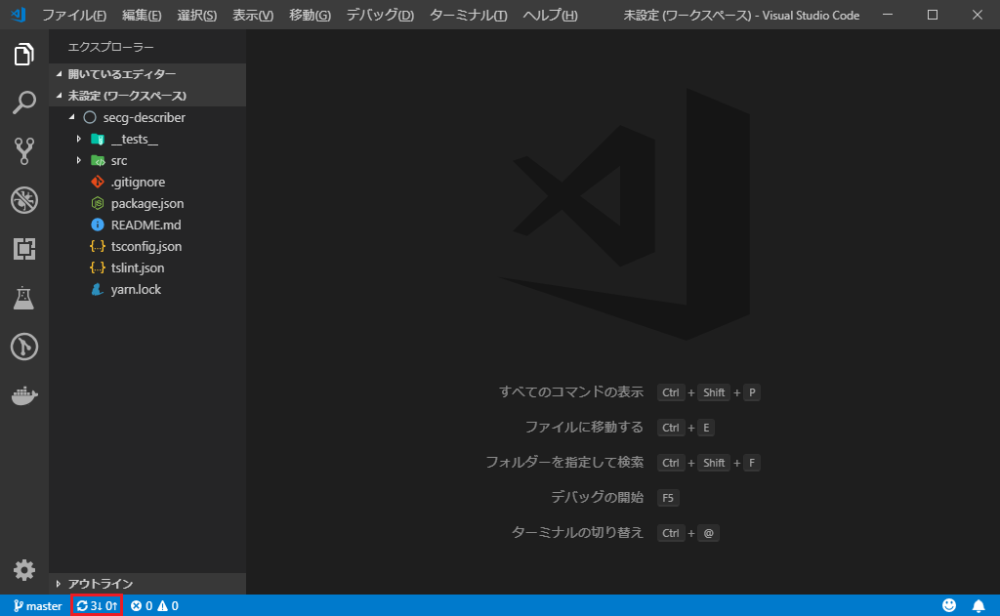

# Githubの使い方

## ローカルリポジトリ

### ローカルリポジトリの作成

1. 作業ディレクトリを作成する．
2. そのディレクトリに移動する．
3. `git init`をすると，.gitという隠しディレクトリができる．
4. .gitがローカルリポジトリ．

### ローカルリポジトリにステージ

VSCodeで編集したりステージングしたりする．

ステージングの方法は，Changesで+のボタンを押すだけ．

### ローカルリポジトリにコミット

1. Commitボタンの上に何かコメントを入力する．
2. Commit

## リモートリポジトリ

### pullとpush

左下の赤枠に注目．



｢↓｣はpull(ダウンロード)すべきもの．

｢↑｣はpush(アップロード)すべきもの

押せばpullとpushをやってくれる．

## ファイルの削除方法

### 1. ローカルリポジトリから削除

1. コマンド

    ```bash
    git rm <filename>
    ```

2. ステージする

    同様にプラスを押す．

3. コメントをつけてコミットする

### 2. リモートリポジトリから削除

pushする．
